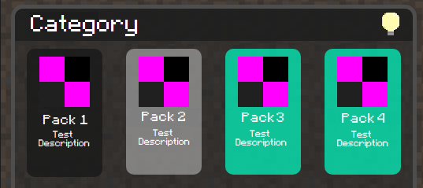
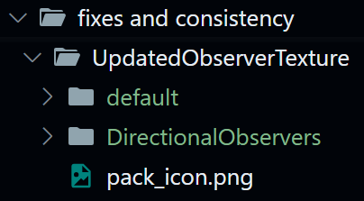

# Explanation of how .json files in the jsons/packs folder work

In each file, you may see something like shown below

```json
{
  "topic": "Category",
  "packs": [
    {
      "pack_id": "Pack3",
      "pack_name": "Pack 3",
      "pack_description": "Test Description",
      "conflict": ["Pack4"],
      "compatibility": ["Pack1"]
    }
  ]
}
```

From the example above, there is a lot going on in the json file. Even though, the objects should be self-explanatory, I will still attempt to explain them.



> Test Image of a GUI

From the image,

1. `Category` refers to `"topic"`
2. `Pack 3` refers to `"pack_name"`
3. `Test Description` refers to `"pack_description"`

However, other things that need mentioning

1. Pack ID and Pack Name are nearly the same

    VT uses a different format for Pack IDs, which make them a bit small. I wanted to finish the JSON quick, so the Pack ID is basically Pack Name without any spaces.
2. Pack 3 and Pack 4 are green when selected.

    As shown in `"conflict"`, Pack4 is there, so when both Pack 3 and Pack 4 are selected, they turn into other colors to indicate the conflict. They should prevent the download from occuring as they conflict, so unlike Vanilla Tweaks, which allows conflicting packs to be downloaded, it is best to prevent it from being downloaded.
3. Compatibility modes do not appear

    I feel compatibility modes would not need marking, rather let it be automatic. If they do not conflict, then why the extra colors? It may be confusing after a while.

The folder structure should hypothetically be like this

`/packs/{topic}/{pack_id}/{compatibility}`

- `{topic}`
	
	Topic from the JSON
	
- `{pack_id}`
	
	Pack ID from the JSON. `{pack_name}` won't be used because it has spaces in it
	
- `{compatibility}`
	
	This is hard to explain.
	
	Here is an example of the json of a pack
	
  ```json
  {
     "pack_id": "UpdatedObserverTexture",
     "pack_name": "Updated Observer Texture",
     "pack_description": "Changes the Observer's top texture to fit in-line with the 1.14 default textures, as it was left out in that update.",
     "conflict": [],
     "compatibility": ["DirectionalObservers"]
  }
  ```
	
  In this example, Updated Observer Texture has a compatibility mode with Directional Observers
	
  This means that the folder structure would be like this

  
	

That should be how the repository would be arranged.

I plan on making a [Text User Interface](https://en.wikipedia.org/wiki/Text-based_user_interface), rather than jumping straight to websites. I have barely any experience with ~~`HTML`~~ and `Javascript`, so I feel if I make a bare-bones version as a TUI with Python, it would be easier to build on top of it.