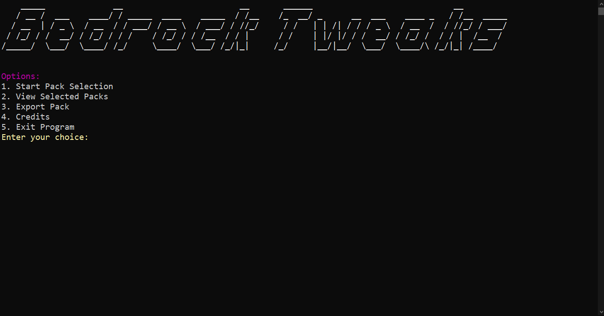
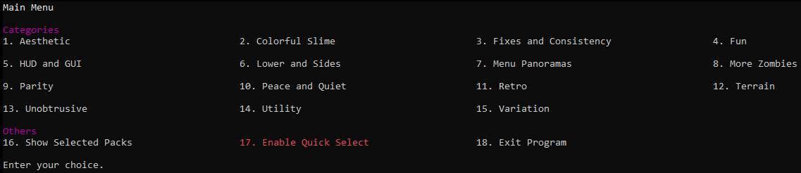
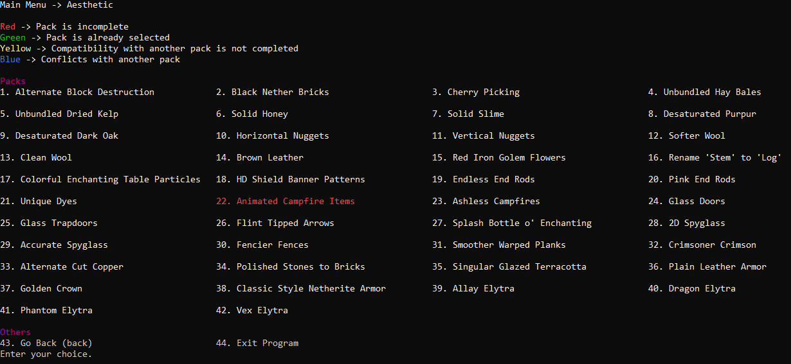

# Tutorial

Before I start, thanks for coming here! It really appreciates me when people use this!

## Download Options:

### Right from the source

You can download the latest commit from
GitHub [here](https://github.com/BedrockTweaks/Bedrock-Tweaks-Base/archive/refs/heads/main.zip) or can also run

```bash
git clone https://github.com/BedrockTweaks/Bedrock-Tweaks-Base/
```

### Stable Release

You can download the latest stable release
from [here](https://github.com/BedrockTweaks/Bedrock-Tweaks-Base/releases/latest)

## Setup

With the zip file, extract it to somewhere you want.

Now, within the folder, go to `pys` as it contains the python scripts.

You want to click on `main.py` and run it with Python. If you have not installed python, make sure to get it
from [here](https://www.python.org/downloads/)

It will do its initial setups, but after that, it should start up with the main menu!

## How to Use?

The program has 5 options (8 for contributors) to select.



### 1. Start Pack Selection

It starts the code for you to make your pack selections!

At first, there will be the categories, which you can input as a number, or the category name.



<sub>Keep in mind that you don't need the exact name, a rough one will do</sub>

In each category, there will be packs that you can select.



Same as before, you can input a number or a rough name

After that, it will prompt you three options (or makes one red based on your chosen packs)

<sub>A picture isn't really required because it is the same 3 options</sub>

### 2. View Selected Packs

Literally what the option says. you **view selected packs**

You also have an option to clear your selected packs (Turned red if nothing is selected)

### 3. Export Pack

Again, literally what the option says. It exports your currently selected pack.

It prompts for a pack name. If left empty, it generates a name in the template of `BTRP-??????` where `?` is a random number from 0-9

After copying neccessary files, it archives the folder, and deletes the folder

<details>
<summary><b>4. Create Folders</b> (contributor only)</summary>

Creates folders and sets them up based on JSON files in <a href="https://github.com/BedrockTweaks/Bedrock-Tweaks-Base/blob/main/jsons/packs">jsons/packs</a>

</details>
<details>
<summary><b>5. Tweaks Image Pixels</b> (contributor only)</summary>

A QOL script that adds variations to pixels instead of just having a smooth pixel colour

</details>
<details>
<summary><b>6. Pre-Commit Checks</b> (contributor only)</summary>

Runs a script that makes neccessary modifications before commiting.

Refer to <a href="https://github.com/NSPC911/Bedrock-Tweaks-Base/blob/main/docs/Explanation%20of%20py%20files.md#L60">Explanation of py files.md</a> for more info on how this works.

</details>

### Credits

Prints [credits.txt](https://github.com/NSPC911/Bedrock-Tweaks-Base/blob/main/credits.txt)

### Exit Program

Boy, I wonder what it does...

# That's it!

<sub>Yep, I lost my sanity with docs</sub>

[<- Back to docs.md](https://github.com/BedrockTweaks/Bedrock-Tweaks-Base/blob/main/docs/docs.md)