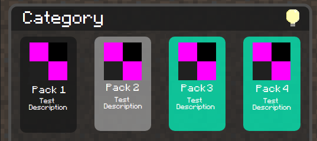

In each JSON, you have many categories
```json
{
  "topic": "Category",
  "packs": [
    {
      "pack_id": "Pack3",
      "pack_name": "Pack 3",
      "pack_description": "Test Description",
      "conflict": ["Pack4"],
      "compatability": ["Pack1"]
    }
  ]
}
```
From the example above, there is a lot going on in the json file. Even though, the objects should be self-explanatory, I will still attempt to explain them.
> How I hope the UI would look like


From the image,
1. `Category` refers to `"topic"`
2. `Pack 3` refers to `"pack_name"`
3. `Test Description` refers to `"pack_description"`

However, other things that need mentioning
1. Pack 3 and Pack 4 are green when selected.

    As shown in `"conflict"`, Pack4 is there, so when both Pack 3 and Pack 4 are selected, they turn into other colors to show conflicts
2. Pack ID and Pack Name are nearly the same
    
    VT uses a different format for Pack IDs, which make them a bit small. I wanted to finish the JSON quick, so the Pack ID is basically Pack Name without any spaces
3. Compatability modes do not appear

    I feel compatability modes would not need marking, rather let it be automatic. If they do not conflict, then why the extra colors?

The folder structure should hypothetically be like this

`{topic}/{pack_id}/{compatability}`

`{topic}` is the topic from the JSON

`{pack_id}` is the pack_id from the JSON. `{pack_name}` won't be used because it has spaces in it

`{compatability}` is optional as the pack may not have compatability with other packs. This may not be the same with vanillatweaks as I can't see whether there is compatability with other packs, so I have to infer them.

That should be how the repository would be arranged.

I plan on making a Text User Interface, rather than jumping straight to websites. I have barely any experience with HTML and Javascript, so I feel if I make a bare-bones version as a TUI with Python, it would be easier to build on top of it.